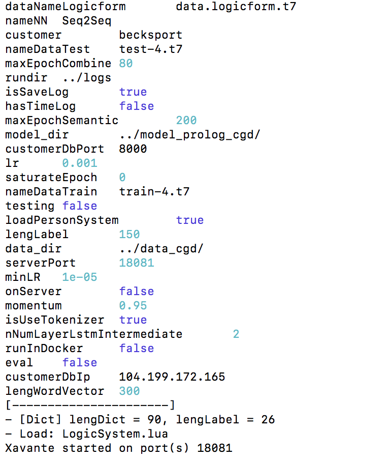

# Document project chatbot in the simulated world 

This project contains 2 part: [`Uninty Application`](https://drive.google.com/open?id=1g8EPd1-Eh5S8Wh6RI3coYyI12O_d_tp2) and [`Chatbot api system`](module-nlp/). 

Unity application like as front end of system and  have some special action such as: take a photo, list object from camera, ... This module will have UI to receive input text from user, send message content to Chatbot system to get some action such as: show reply message, take a photo, ...

Chatbot api system is a resful api server run on Torch7 framework, and Lua programing. To run this server, need install torch7 framework and some package support build server. This environment will be provided via docker. ([docker](https://docs.docker.com/docker-for-windows/install/) is a software make virtual machine which is usually use on linux similar with virtualbox, vmware.. on window)


## 1. Run unity application 

- Open unity project (name: `New Unity Project - Copy (2)`) 
    - _Note: Because this project base on tutorial for beginer, so when re-open this project, code of this project will be reset (sorry for the inconvenience) ._
- Open scene `Done3` in folder `_Scenes` to recovery state scene.
- In the `Hierachy` window, open `Player` to change code controller. 
- Replace code from file `ThirdPersonUserControl.cs` to controll `Player` agent.
- Drag some object in `Hierachy` window to make relationship in code `ThirdPersonUserControl.cs`
    - public InputField messageUserInput;
    - public InputField messageBotRep;
    - public Image viewOfBot;
    - public Camera cameraBot;
    - public BoxCollider pushableBox;
    - public float timeShowMessagePlayer;
    - public Text logMessage;

## 2. Run server chatbot system

### 2.1. Build environment Torch7 framework   

This tutorial to install torch 7 framework and some libs which used in `module-nlp`. 

```commanline

# install docker via https://docs.docker.com/docker-for-windows/install/

# clone docker image which have environment torch  
docker pull hatakekkshi/torch7-fulllibs 

# open terminal on folder of this repo 
cd path/to/ssp-nii-prj

# run docker container - run new Virtual Machine - service need port 18081 to run on local 
docker run -it --rm --name "torch7-env" -p 18081:18081 -v "$PWD":/code hatakekkshi/torch7-fulllibs

# note if u want to exit terminal docker without kill process docker. U can use 2 shortkey: Ctrl + p && Ctrl + q. This make termial detached and the docker process can run on background. To attach use: docker attach torch7-env

# go to code folder to run server 
cd /code/module-nlp/src/ 

# run server 
sh startServer.sh

```




_Try request to server_

```commandline
cd path/to/ssp-nii-prj
cd module-nlp/src
sh sampleRequest.sh
```
_Output_

```
{"form":"what ( can ( bot ( ) _do ( ) ) )","windows":[{"type":"SHOW_MESSAGE","payload":"Now, I just can take a photo for u. Sorry and I love u <3."}],"msg":"what can u do"}
```

! Run server nlp sucessful via docker 


### 2.2. Connect with Unity Application

- If docker and unity Application in the same PC. We use domain `localhost:18081` to connect. 

    Change content file `ThirdPersonUserControl.cs` line 224: 

    string URL = "http://136.187.35.85:18081/chat-bot/get-windows";

    to

    string URL = "http://localhost:18081/chat-bot/get-windows";


- If docker and unity Application NOT in the same PC. We need ip of PC (`x.x.x.x`) run service module-nlp like as `x.x.x.x:18081` to connect. 

    Change content file `ThirdPersonUserControl.cs` line 224: 

    string URL = "http://136.187.35.85:18081/chat-bot/get-windows";

    to

    string URL = "http://x.x.x.x:18081/chat-bot/get-windows";


